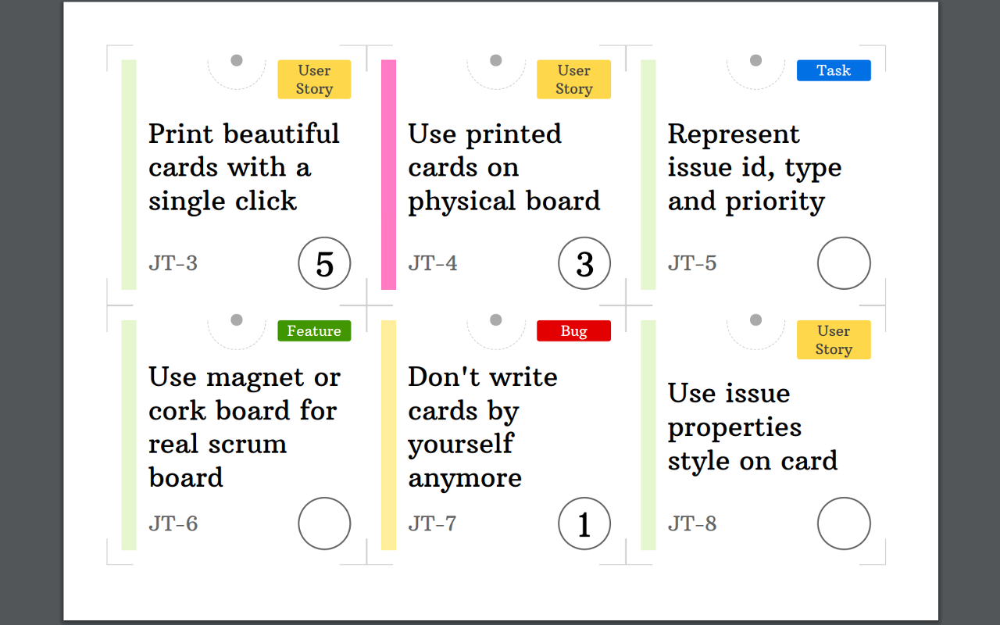

# YouTrack Issue Cards Printer

Chrome extension that allows to print issues from YouTrack as cards
for physical scrum board.

If you find this extension useful,
fill free to support me by PayPal:
[](https://www.paypal.com/cgi-bin/webscr?cmd=_s-xclick&hosted_button_id=ZPT5PRWA9V9BW)



## How to use

1. Install extension:  
[](https://chrome.google.com/webstore/detail/youtrack-issue-cards-prin/pjcejghclgihlhinleocjojdalhnhckp)
2. Go to your YouTrack issues list - [https://your-youtrack-domain/issues](https://your-youtrack-domain/issues)
3. Filter issues you want to print.
4. Click extension icon to print cards.

## Customization

Open extension options to customize issue fields and style.
Read the [customization documentation](doc/customization.md).

## Changelog

See the [changelog](CHANGELOG.md).

## Limitations

This extension does not support some cases that may produce unexpected behavior,
like printing not exactly the same issues that are listed in YouTrack.

Known limitations are listed below. 

### Custom issues order

By default issues in YouTrack are sorted by last update time.
Sorting may be changed below search bar, and it changes search request.
This is fully supported.

On the other hand, issues may be reordered manually by dragging them.
Sort order shows then `The results are sorted by: custom order, ...`.
Custom order is ignored by the extension and only other sort directives are used.

## Build for Chrome Web Store

```bash
VERSION=x.x.x
git tag -a "v$VERSION"
git archive -o "release-v$VERSION.zip" "tags/v$VERSION"
```

## Technical notes

### Activating extension declaratively

Extension shows as active on all pages
because of replace print button script injection
to any page.

Much better would be to inject script declaratively
only to pages identified by as YouTrack,
like we do for page action button enabling.
This would cause extension to show as disabled on other pages.

Unfortunately, only URL matching is available for page content scripts
as of Chrome 73. Required option to inject scripts based on CSS content matching,
[RequestContentScript](https://developer.chrome.com/extensions/declarativeContent#type-RequestContentScript),
is experimental and not supported in stable builds.

For the new (experimental) issues list layout in YT 2019.1
there is no support for print button anyway. Maybe in future
we could drop support for old YT and print button whatsoever.

### Support for the old and new issues list layout

Right now extension supports both old issues list layout
and the new (experimental) one introduced in YT 2019.1.

In case of dropping support for old layout in future,
handling print button may be removed. 
